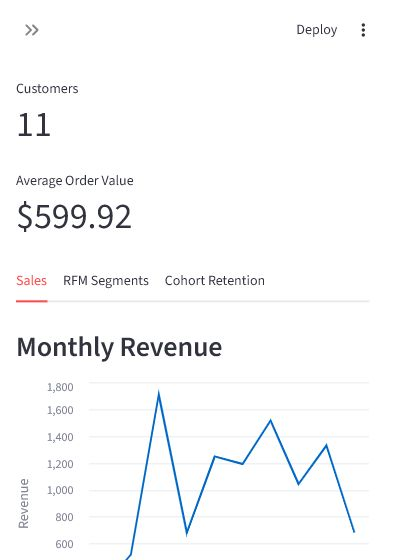
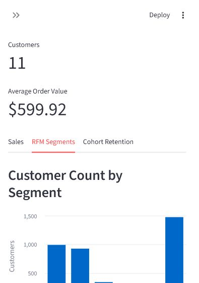
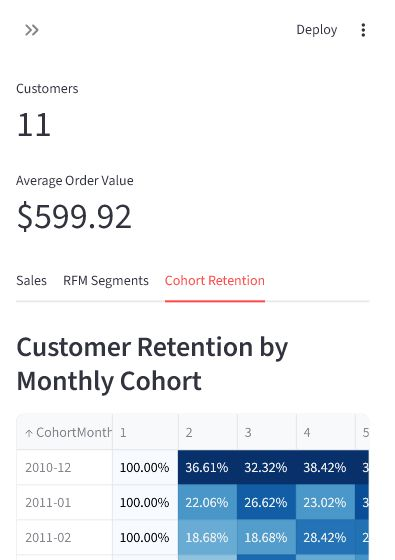

# Online Retail Sales Analysis with RFM, Cohort Analysis, and Dashboard

## Project Overview

This portfolio project analyzes online retail transaction data to understand sales performance, customer value, customer retention, product performance, and country-level performance.

The project started with cleaning and exploratory analysis, then was expanded with RFM customer segmentation, cohort retention analysis, SQL business questions, and a Streamlit dashboard.

## Business Questions

- What is the total revenue, total orders, total customers, and average order value?
- How does revenue change over time?
- Which products generate the most revenue?
- Which countries contribute the most revenue?
- Who are the most valuable customers?
- Which customers are champions, loyal customers, at risk, or new/recent customers?
- How well does the business retain customers after their first purchase month?
- Which monthly customer cohorts show stronger repeat purchase behavior?

## Dataset

The project uses an online retail transaction dataset with invoice, product, quantity, date, price, customer, country, and revenue fields.

- `data/OnlineRetail.csv`: raw dataset
- `data/cleaned_retail.csv`: cleaned dataset used for analysis

## Project Structure

```text
online-retail-sales-analysis-rfm-dashboard/
  data/
    OnlineRetail.csv
    cleaned_retail.csv
  dashboard/
    app.py
  notebook/
    retail_sales_analysis.ipynb
  outputs/
    cohort_retention.csv
    rfm_segments.csv
  sql/
    retail_business_queries.sql
    rfm_and_cohort_queries.sql
  README.md
  requirements.txt
  .gitignore
```

## Tools Used

- Python
- Pandas
- Matplotlib
- SQL / SQLite
- Streamlit
- Jupyter Notebook

## How to Run the Dashboard

Install the required packages:

```bash
pip install -r requirements.txt
```

Run the Streamlit dashboard:

```bash
streamlit run dashboard/app.py
```

## Key Analysis Added

### RFM Analysis

RFM analysis groups customers using:

- Recency: how recently a customer purchased
- Frequency: how often a customer purchased
- Monetary: how much a customer spent

The output file is saved at:

```text
outputs/rfm_segments.csv
```

### Cohort Analysis

Cohort analysis groups customers by their first purchase month and measures how many return in later months.

The output file is saved at:

```text
outputs/cohort_retention.csv
```

## Dashboard Preview

### Sales Overview


### RFM Customer Segments


### Cohort Retention


## Dashboard Pages

- Sales overview
- RFM customer segments
- Cohort retention table

## Portfolio Summary

This project demonstrates how a data analyst can clean transaction data, answer business questions with Python and SQL, segment customers using RFM analysis, measure customer retention with cohort analysis, and communicate insights through an interactive dashboard.
